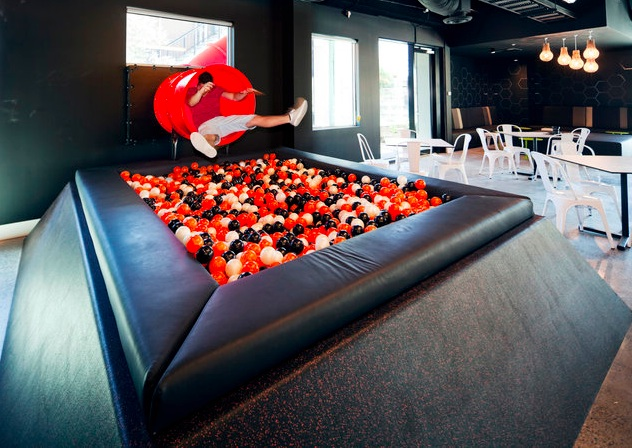

# Why Elm Makes me Happy!

---

## What is Elm?

"A delightful language for reliable webapps."

Note:
- First things first, what is Elm?
- Elm describes itself as "A delightful language for reliable webapps" - well beging delighted and producing reliable code are grounds for happiness, but even given my time limit I think its worth going a bit deeper, so why does it make me happy

---

## Its _*Not*_ JAVASCRIPT

Note:
- Because its not Javascript...
- Actually that's too easy - and its not really helpful. Javascript is an immensley capable language and its ubiquity makes something like elm possible - it would be better to talk about what elm is rather than what its not, so elm is three things

---

## Elm Language:

@ul

- Strictly Typed
- Functional
- Only supports Pure Functions
    - NO SIDE EFFECTS!

@ulend

Note:

- The first thing Elm is is a language
- Its Strictly typed - this makes the compiler your friend and there is sufficent depth in the Elm type system to be interesting (?? pick this up where) withou being overwhelming
- Only supports pure functions - by which we mean that for any given input a function will always return the same output and there are _no side effects_ - this makes functions very testable and helps in reasoning about them
- At this point you may have notice a small problem - user interaction, rendering HTML etc is a side effect and user input is non deterministic, if all our functions are pure how do we create a user interface?
- For this we need

---

Note:
- TEA! Because of course tea makes one happy...

---

**T**he
**E**lm
**A**rchitecture

@ul

- Model -> View -> Update

@ulend

Note:
- In this case Tea is "The Elm Architecture" - specifically the Model, View, Update pattern - which evolved in Elm and is the inspiration for Redux and by extension a lot of contemporary thinking in client application frameworks
- Pragmatically this provides a framework in which Elm runs your pure functions and handles the messy bits

---

@ul

* Model
* View: `view : Model -> Html Msg`
* Update: `update : Msg -> Model -> (Model, Cmd Msg)`

@ulend

Note:

- In a bit more detail, the model defines the current state
- view is a function that takes the model and translates it into the HTML to be displayed
- update is a function that takes a message - which is an algebraic data type (Elm name here) that is defined as part of the application and specfies all the events that can occur in the application - and the model and returns not only the model after the action required by the message has been applied but also a command - which might be none or might be say an http request along with the message (from our defined list) to return when that request completes
- And this is how we square the circle of no side effects - the code I write is pure, I can reason about it, I can test it. External events - things that are non-deterministic - are handled by the runtime framework.

---

# So what's the third thing?

Note:

- You may recall that I said Elm was 3 things - I've described the first two, the Language and the Framework the third is

---

# Its opinionated

Note:

- Both the language and community have opinions about how things should be done, one of the core tennents is that there should be one way of doing things - for so long as that is good enough. So you format code using the elm format tool and

- It seems to me that the creator of the language and the community growing around Elm have a philosophy that defines the approach both to creating the language and to writing applications, this starts with the notion that there should be one way to do things and so long as that works well there's no need to add more. That the type system and the compiler should make adding to or refactoring your application an easy and comfortable experience. And extends to the functional programming ideal of making invalid states unrepresentable in your model (which sits nicely with making changes to your code safe and easy).

- This doesn't mean that the current choices are immutable, more that there's not endless re-invention of the wheel and that we can worry less about what the "right" way to do things is.

- And this starts to get to why Elm makes me happy

---

# Constraints

Note:

Elm places constraints on us
- It has a narrow focus, it exists to create web client applications and nothing else
- The language and type system is deliberately limited - no higher kinded types for example
- You have a very limited capability to interact directly with javascript - there is no Foreign Function Interface
- BUT

---

# *Liberating* Constraints

@ul

@quote[Only write the code that only you can write]

@ulend

Note:
These are *liberating* constraints - these are thing that make it easier for me to effectively deliver value.
- From a language point of view the fact that functions are pure and other language features mean that the compiler and runtime can produce very efficient javascript (compact and fast) that won't error.
- From a developer point of view the simplicity of the language and the type system makes it easier to learn, and once learnt I waste less effort making unnecessary choices - be that in the language constructs I use, or the patterns I follow - and I can focus on what actually adds value which is to "only write the code that only you can write"
- These constraints are not limiting, there are a number of companies who I think would argue that their use of Elm provides them with a competitive advantage.

---

Note:
Put another way elm helps me fall into the pit of success.

Of course none of these attributes are unique to Elm, the strong typing, the functional approach, the patterns, they can all be found and applied in other languages and other ecosystems - where Elm is nice is in that it brings all of these things together

---

Note:

So its all sunshine and roses then? Well no... so long as you can live within the constraints yes, but to take the obvious example the lack of a foreign function interface means more work to solve some problems like a dependency on javascript SDK. In addition the styling story is still being worked out and I don't think there will ever be a single way to resolve that.

---

# Why does Elm make me happy?

@ul

It helps me 

** Build IT Right **

@ulend

Note:

But to return to the original question - why, as a software engineer, does Elm make me happy and why did I proprose a session for this conference?

Because I believe Elm helps me

BUILD IT RIGHT!

*Thankyou*

---

