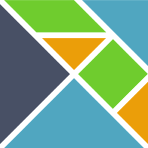

# Why Elm Makes me Happy!

---

@snap[west]

@snapend

@snap[east]
## What is Elm?

@quote[A delightful language for reliable webapps]
@snapend

Note:
- First things first, what is Elm?
- Elm describes itself as "A delightful language for reliable webapps" - well being delighted and producing reliable code are grounds for happiness, but even given my time limit I think its worth going a bit deeper, so why _does_ it make me happy?

---

## Its _*Not*_ JAVASCRIPT

Note:
- Because its not Javascript...
- Actually that's too easy - its a cheap laugh and it not constructive. Javascript is an immensely capable language and its ubiquity makes something like elm possible - much better to talk about what elm _is_ rather than what its not, so to me elm is three things

---

## Elm Language:

@ul

- Functional
- Statically Typed
- Immutable
- Only supports Pure Functions
    - NO SIDE EFFECTS!

@ulend

Note:

- The first thing Elm is is a language
- Its a functional language with an ML like syntax - I believe that functional languages and functional programming have the potential to be highly productive so this is a good start
- Its Statically typed - but with impressive type inference, this makes the compiler your friend and there is sufficent depth in the Elm type system to allow you to create complex models as needed.
- Values are immutable
- Only supports pure functions - by which we mean that for any given input a function will always return the same output and there are _no side effects_ - this makes functions very testable and helps in reasoning about them
- At this point you may have noticed a small problem - rendering HTML is a side effect and user input and server responses are non deterministic, if all our functions are pure how do we create a user interface?
- For this we need...

---

@snap[middle]

@snapend

Note:

- TEA! Because of course tea makes one happy...

---

@snap[west]

## **T**he

## **E**lm

## **A**rchitecture

@ul

- Model -> View -> Update

@ulend

@snapend

Note:

- In this case Tea is "The Elm Architecture" - specifically the Model, View, Update pattern - which evolved in Elm and is the inspiration for Redux and by extension a lot of the thinking in contemporary client application frameworks
- Pragmatically this provides the second piece of Elm - a framework which runs your pure functions and handles the messy bits

---

@ul

- Model
- View: `view : Model -> Html Msg`
- Update: `update : Msg -> Model -> (Model, Cmd Msg)`

@ulend

Note:

- In a bit more detail, the model defines the current state
- view is a function that takes the model and translates it into the HTML to be displayed - we can use functions to compose a complex view from simple pieces
- update is a function that takes a message - which given that Elm is statically typed, comes from a list we've defined for ourselves - and the current model. It then returns a new model changed as required by the message (and the parameters attached to the message), it may also return a command which typically could be an instruction to trigger an http request to send data to or get data from a server. The response to the request will come back as a new message triggering a new invocation of the update function.
- And this is how we square the circle of no side effects - the code I write is pure, I can reason about it, I can test it. External events - things that are non-deterministic - are handled by the runtime framework and delivered as strongly typed messages.
- The code, the application, is then event driven and the pieces easy to reason about.

---

## So what's the third thing?

Note:

- You may recall that I said Elm was 3 things - I've described the first two, the Language and the Framework the best way I can describe the third is

---

## Its opinionated

Note:

- It seems to me that Evan Czaplicki, the creator of Elm, and the community growing around it have a philosophy that defines the approach both to creating the language and to writing applications, this starts with the notion that there should be one way to do things and so long as that works well there's no need to add more. That the type system and the compiler should make adding to or refactoring your application an easy and comfortable experience. And extends to the functional programming ideal of making invalid states unrepresentable in your model (which sits nicely with making changes to your code safe and easy).

- This doesn't mean that the current choices are immutable, more that there's not endless re-invention of the wheel and that we can worry less about what the "right" way to do things is.

- And this starts to get to why Elm makes me happy

---

## Constraints

Note:

Elm places constraints on us - some of the are:

- That it has a narrow focus, it exists to create web client applications and nothing else
- That the language and type system are deliberately limited - no higher kinded types for example
- That you have a very limited capability to interact directly with javascript - it can be done but there is no direct Foreign Function Interface - elm packages have to be written in elm
- HOWEVER

---

## *Liberating* Constraints

@ul

@quote[Only write the code that only you can write]

@ulend

Note:
These are *liberating* constraints - these are thing that make it easier for me to effectively deliver value.

- From a language point of view the fact that functions are pure and other language features mean that the compiler and runtime can produce very efficient javascript (both fast and compact) that won't error.
- From a developer point of view it hits the golidlocks zone not too big and not too small. Its easy to learn, and once learnt demands less effort in making unnecessary choices - be that in the language constructs I use, or the patterns I follow - and I can focus on what actually adds value which is to "only write the code that only we can write"

---

Note:
Put another way elm helps me slide into the pit of success.
at it brings all of these things together

---

@snap[west]

@snapend

@snap[east]

@snapend

Note:

So its all sunshine and roses then? Well no... so long as you can live within the constraints yes, but its its own language and ecosystem and, to take the obvious example, the lack of a foreign function interface means more work to solve some problems like a hard dependency on a javascript SDK.

---

## Why _does_ Elm make me happy?

@ul

- It helps me

@ulend

@snap[south span-50]
@box[bg-green rounded box-padding fragment](** Build IT Right **)
@snapend

Note:

But to return to the original question - why, as a software engineer, does Elm make me happy and why did I proprose a session for this conference?

Well... whilst none of these thing I like - the strong typing, the functional approach, the patterns - are unique to Elm and can be found and applied in other languages and other ecosystems - where Elm is nice is in that it brings all of these things together in an elegant package

And because I believe Elm helps me

BUILD IT RIGHT!

*Thank you*
